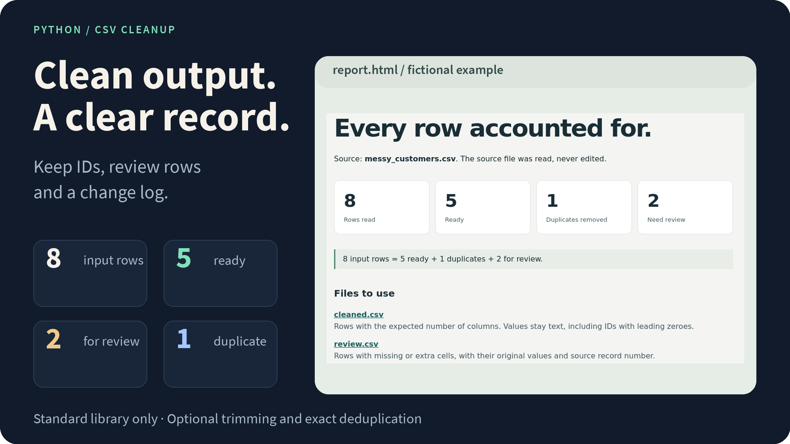

# CSV Cleanup

Clean a CSV export and keep a record of what changed. IDs stay text, rows with missing or extra cells go to review, and the result comes with a readable report.

<picture>
  <source media="(max-width: 600px)" srcset="docs/assets/overview-mobile.png">
  
</picture>

**[See the example report](https://jackspiece.github.io/csv-cleanup-example/)** · **[Quick start](#quick-start)** · [Behavior and limits](docs/behavior.md)

[](https://github.com/jackspiece/csv-cleanup-example/actions/workflows/check.yml)

Python 3.11+ · Standard library only · Verified on Linux

## Quick start

```sh
git clone https://github.com/jackspiece/csv-cleanup-example.git
cd csv-cleanup-example
python tidy_csv.py examples/messy_customers.csv result --trim --deduplicate
```

Open **`result/report.html`** in your browser. Use a new output directory for each run.

The included data is fictional. With the two flags above, the example produces:

| Input | Ready | Review | Duplicate |
| ---: | ---: | ---: | ---: |
| 8 | 5 | 2 | 1 |

**[Browse the saved output files →](examples/checked)**

## What you get

| File | Purpose |
| --- | --- |
| `cleaned.csv` | Rows with the expected columns and the transformations you requested. |
| `review.csv` | Malformed rows, original values and source record numbers. |
| `audit.jsonl` | A trace of changes, duplicate removal and review decisions. |
| `summary.json` | Counts, settings and a fingerprint of the source file. |
| `report.html` | A local page linking the results. |

## The rules are deliberately small

Trimming and exact deduplication are optional. Duplicate comparison uses the whole row after any requested trimming. It does not guess whether different names belong to the same person.

Values stay text: `00017` remains `00017`. Dates, currencies and missing values are not inferred. Spreadsheet applications may still guess types when opening a CSV, so import identifier columns as text.

Invalid quoting, invalid UTF-8 and ambiguous headers stop the run without publishing partial output. Rows with the wrong number of cells are retained for review.

See **[the complete behavior guide](docs/behavior.md)** for delimiters, encoding, record numbers and output protection.

## Run the checks

```sh
python -m unittest discover -s tests -v
```

Ten tests cover text preservation, quoted and multiline fields, optional transformations, record accounting and malformed input.

---

Built by [jackspiece](https://github.com/jackspiece). For a small CSV or Python job, [open a project enquiry](https://github.com/jackspiece/csv-cleanup-example/issues/new?template=work-request.md) with a redacted example. Scope, price and funding are agreed before work starts. Keep private customer and payment details out of public issues.
