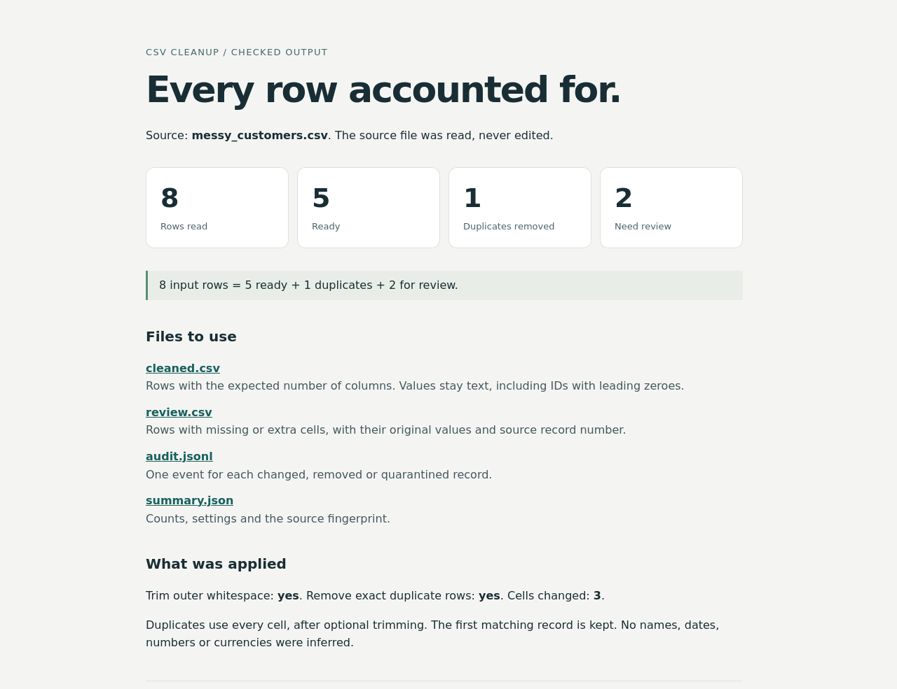

# CSV cleanup, with a record of what changed

A small Python work sample: clean a CSV export while keeping IDs, quoted text and a trace of every removed or rejected record. It uses only the Python standard library.

```sh
python tidy_csv.py examples/messy_customers.csv result --trim --deduplicate
```

Open `result/report.html` for the counts and links to the output files. The example contains fictional data: 8 records become 5 ready rows, 1 exact duplicate and 2 rows for review.



The generated example files are in [`examples/checked`](examples/checked).

| File | What it contains |
| --- | --- |
| `cleaned.csv` | Valid rows, with the transformations you requested. |
| `review.csv` | Rows with too many or too few cells, including their original values. |
| `audit.jsonl` | Record numbers for changes, duplicates and rows sent for review. |
| `summary.json` | Counts, settings and a SHA-256 fingerprint of the source file. |
| `report.html` | A readable, local report. |

Trimming and deduplication are both optional. Without those flags, whitespace and repeated records are kept. Deduplication compares the entire row after optional trimming and keeps the first match. It does not decide that two different names or email addresses belong to the same person.

All fields stay text. `00017` stays `00017`, and `1,204.50` stays `1,204.50`. The tool does not guess dates, currencies, missing values or the input delimiter. Spreadsheet applications can still interpret text when you open a CSV; choose text columns when importing identifiers.

The source must be UTF-8, with an optional BOM. Use `--delimiter ';'` for a semicolon file or `--delimiter tab` for TSV. Output uses UTF-8 and comma-separated fields. Record numbers count CSV records, including the header, rather than physical lines; a quoted multiline field is one record.

The output folder must be new. Invalid quoting, invalid UTF-8 and ambiguous headers stop the run without publishing partial output. Rows with the wrong cell count are preserved for review. Inspect that file before using the cleaned data.

Requires Python 3.11 or newer on Linux. Other operating systems have not been validated.

```sh
python -m unittest discover -s tests -v
```

The tests cover leading zeroes, Unicode, embedded commas and newlines, opt-in transformations, row accounting, retained review data, malformed input and existing-output protection.

## Small paid jobs

I’m [jackspiece](https://github.com/jackspiece). I’m available for small Python fixes and CSV cleanup jobs, with a fixed scope and price agreed before work starts. Delivery includes reproducible checks.

[Open a project enquiry](https://github.com/jackspiece/csv-cleanup-example/issues/new?template=work-request.md). A description and a sample with private values removed are enough to assess a job. Please keep real customer data out of public GitHub issues.
